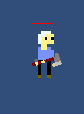
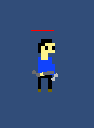
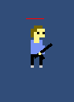
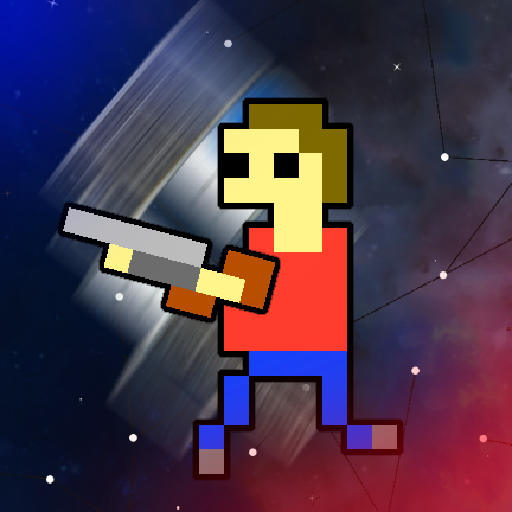

### This Month in Clone Station: Gearing Up for Open Beta

The past month has been all about **preparing World 1** for the **open beta**. That means moving from core systems to polish - filling in gaps, tuning difficulty, and finally getting some marketing materials in shape. Here's what I've been up to.   

---

### A Full Roster of Enemies (World 1 Complete!)

Until now, most rooms were populated with basic grunts - fine for testing, but not enough to make the levels feel distinct. I added a couple of new enemy types with varied weapons, movement speeds, and health values.

These additions help increase level variety and set the stage for **scaling difficulty** across World 1.

*All 10 levels are now in and playable!*


  
  
  

---

### Finally Switched to the New Unity Input System 

This was long overdue. I finally migrated from the legacy input system to Unity's "new" Input System.

Why it matters:
- Floating joysticks for mobile - they now follow the player's thumb instead of staying fixed
- Easier local testing with gamepads - I can swap between controller or on-screen joysticks without changing settings

It was a bit of work to retrofit everything, but it's a solid foundation going forward.

---

### Difficulty Pass: Early Game Balancing

Now that World 1 has a full level set, I went through and tuned:
- Enemy spawn frequencies
- Enemy difficulty
- Room Selection for Levels
- Star challenges

The first few levels are now tuned to feel **accessible for new players**, while still offering some optional challenges via the star conditions. Later levels ramp up more gradually, ending in a proper boss encounter with the Spawner.

---

### Branding for the Road Ahead

With open beta on the horizon, I spent some time on:
- Refreshed **App Icon** using the player character
- **GameDevHobby** branding for devlogs, social posts, and future Play Store assets

These are small steps, but they help create a more cohesive feel around the project.

---

### What's Next?

As I wrap up World 1 content, I'm shifting focus to:
- Polish & bug fixes before open beta
- Play Store setup with screenshots, trailer, and description
- More audio/visual feedback in combat

It's getting close.

---

Thanks for following the journey!

---
