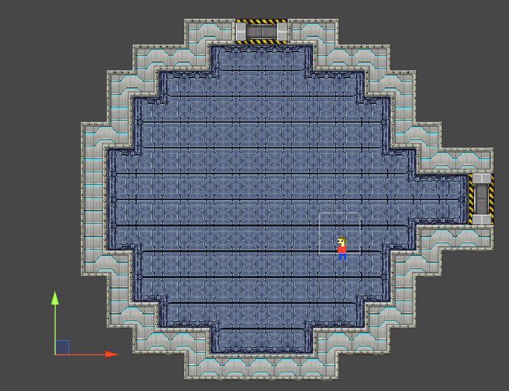
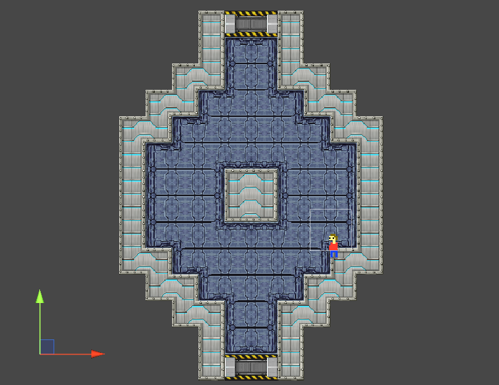
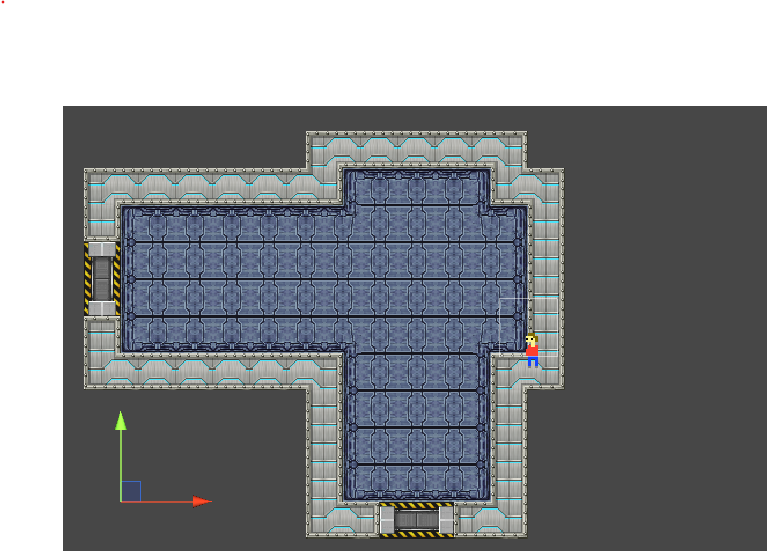
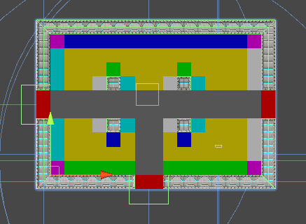
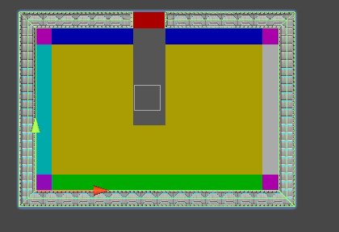
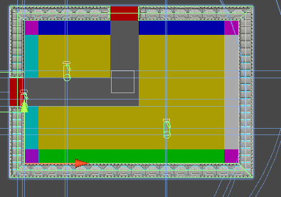
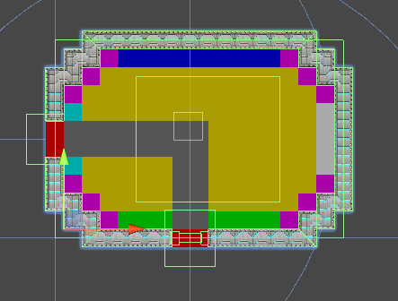
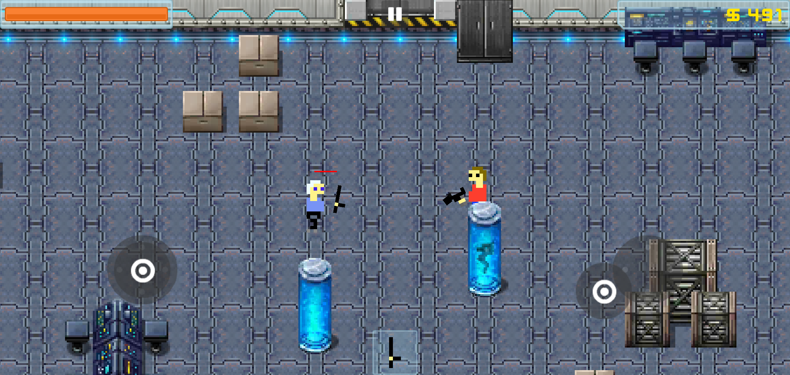

### This Week in CloneStation – Filling the Void

**What’s New**
- Added new room shapes: **Circles**, **Donuts**, and **Expanded Hallways**
- Implemented a **prop system** for placing furniture and decorations
- Designed a logic-based layout for props (not just random!)
- Ensured **walkability** and **enemy accessibility** in procedurally generated rooms

**What’s Happening Behind the Scenes**

Early on, rooms in CloneStation were just bland rectangles—big, empty spaces with the occasional random box plopped in. It worked... but it wasn’t fun. So I set out to give these rooms more personality and gameplay flavor.


To make spaces more visually and structurally interesting, I started by experimenting with new room shapes: **circular arenas**, **donut-shaped chambers**, and **wider hallways** to break up the rhythm. These instantly made the layout feel less predictable.


  
  
  


But variety in shape wasn’t enough. I wanted players to feel like they were walking through real, functional spaces—abandoned control rooms, eerie bunk areas, cluttered storage chambers. That meant **props**: furniture, decoration, and visual noise that makes rooms feel lived-in (or long since evacuated).

The trick was making the placement *feel natural*. Props needed to appear logically, mostly near walls with some strays in open spaces. So I built a system to determine if a tile was adjacent to a wall—and if so, which side. This informed which props could be placed and in what orientation.


  
  
  
  


Each prop had rules: whether it needed to be near a wall, and how much space it could occupy. From there, it was all about tweaking placement frequency, keeping critical walkways open, and making sure enemies wouldn’t spawn somewhere unreachable.

Honestly? This was a tough one. Since the whole dungeon is procedural, I couldn't just hand-place things. Everything had to be algorithmically smart. But the payoff is a dungeon that feels way more alive.

Here’s a sneak peek:

