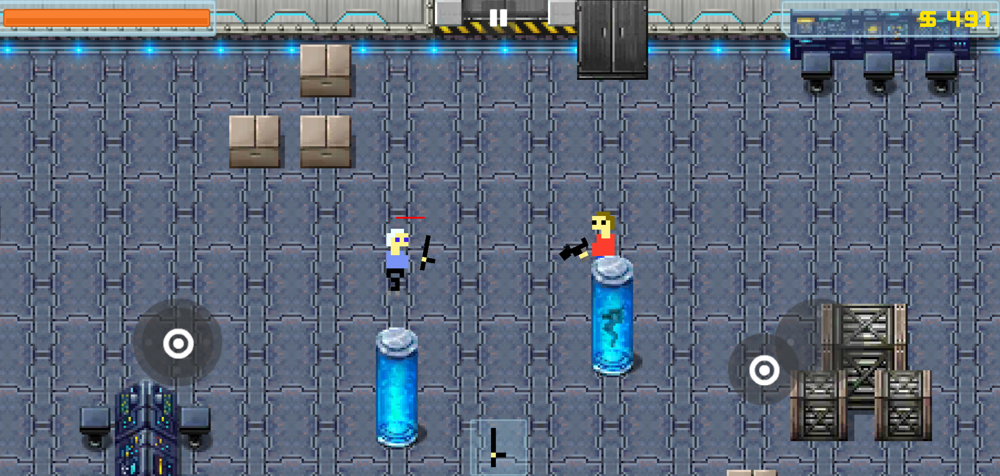

_Clone. Escape. Repeat._  
A retro-inspired top-down shooter set aboard a a series of procedurally-generated space stations full of danger and secrets.

---

## About the Game

**Clone Station** is a sci-fi action game where you are trying to survive and escape from a procedurally-generated space station overrun with failed experiments, hordes of clones, and collapsing infrastructure.

- Fast-paced top-down shooting
- Randomized dungeon layouts
- Challenging enemy encounters
- Progression elements
- Unlockable weapons

---

## Screenshots

_Explore the gritty neon-lit corridors, brutal combat zones, and creepy labs of Clone Station._

<!-- Image 1: Add an in-game screenshot showing the player in action -->

*Caption: a Clone encounter.*
<!-- 
<!-- Image 2: Another key moment, maybe a boss fight or dramatic scene - ->

*Caption: Intense boss encounter in a flickering reactor room.*

<!-- Image 3: HUD or Upgrade screen - ->

*Caption: Unlock new weapons and clone enhancements.* -->

---

<!-- ## Trailer / Gameplay Video

*Clone Station Alpha Gameplay Preview*

--- -->

## Key Features

- **Procedural Dungeon Generation:** Every run is unique with different room layouts, hazards, and secrets.
- **Tight Controls:** Fast movement and responsive shooting.
- **Upgrades:** Find weapons, clone enhancements, and secrets to gain an edge.

---

## Status

**Current Version:** Alpha  
**Next Milestone:** World One Completion + Open Beta  
**Platforms:** Android (Google Play)  
**Engine:** Unity

---

## Follow Development

> Clone Station is a solo indie project by me
> You can follow the development via:
- [Devlog](/posts/)
