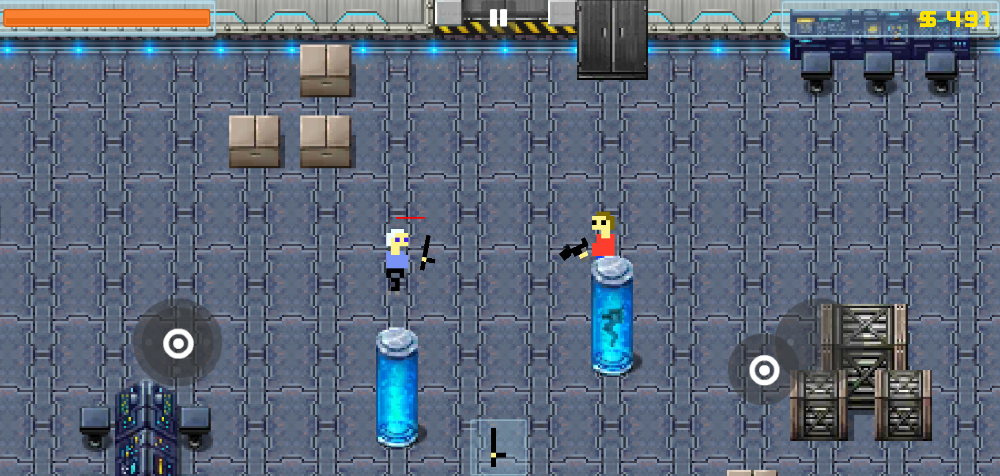

_Clone. Escape. Repeat._  
A retro-inspired top-down shooter set aboard a series of procedurally-generated space stations full of danger and secrets.

---

## About the Game

**Clone Station** is a sci-fi action game where you fight to survive and escape procedurally-generated stations overrun by failed experiments, rogue clones, and collapsing infrastructure.

Runs are built around fast movement, room-to-room combat, and adapting your loadout as the dungeon changes.

## Core Loop

- Enter a run and clear combat encounters room by room.
- Manage pressure from varied enemy types and room hazards.
- Collect upgrades and improve your build as difficulty ramps.
- Complete level objectives and chase better ratings.

## Recent Milestones

- **World 1 complete:** 10 playable levels now form a full first-world arc.
- **New enemy roster:** added enemies with different weapons, speed, and health profiles.
- **Input overhaul:** migrated to Unity's new Input System, including floating mobile joysticks.
- **Balance pass:** tuned spawn rates, challenge pacing, and early-level onboarding.
- **Open beta live:** current Android build is available on Google Play.

## Systems and Tech

- **Procedural dungeon generation:** varied room layouts including circles, donuts, and expanded hallways.
- **Environmental dressing:** a rule-driven prop system that keeps spaces readable and walkable.
- **Progression framework:** level ratings and reward-oriented progression.
- **Gameplay architecture:** event-driven systems and modular enemy behavior logic.

---

## Screenshots

_Explore the gritty neon-lit corridors, brutal combat zones, and creepy labs of Clone Station._

*Combat pressure in one of the station's procedurally-generated encounter rooms.*

---

## Status

**Current Version:** Open Beta  
**Build Scope:** World 1 complete (10 levels)  
**Next Milestone:** Post-beta polish, balance updates, and subsequent world development  
**Platforms:** Android (Google Play)  
**Engine:** Unity

## Download



- [Clone Station Feedback Form](https://forms.gle/P12tiZ3S1D9aoRfV7)

---

## Follow Development

> Clone Station is a solo indie project by me, with creative collaboration from my daughter Fae on selected content and visuals.
> You can follow the development via:
- [Devlog](/posts/)
