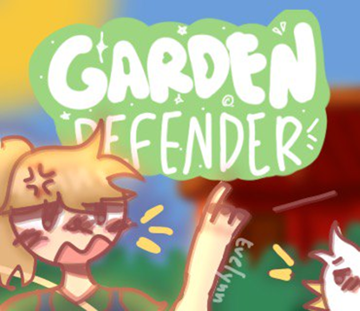

_Hold the line against hungry critters._

---

## About the Game

In **Garden Defender**, you protect a small farm from waves of hungry livestock that try to eat through your crops.
You plant, position, and react under pressure as each round gets busier and harder to control.
The goal of this jam build was to keep the loop easy to read but increasingly chaotic as the field fills up.

## Core Loop

- Plant and grow crops to build your economy.
- Place defensive support and react to incoming animals.
- Balance expansion with survival as the map gets crowded.
- Hold out long enough to stabilize your garden.

## What I Built For This Jam

- A fast browser-playable prototype focused on short sessions.
- Crop progression with multiple crop types.
- Enemy pressure that ramps over time.
- A readable, top-down layout that supports quick decision-making.

## Jam

Submission to **Godot Wild Jam #62**.

## Reflection

This project helped me practice scope control: keep one strong mechanic loop, then push difficulty and pacing.
If I continue this concept, I want deeper upgrade choices and clearer visual feedback for threat priority.

## Collaboration

I built this project with my daughter, **Fae** (now 14, and younger when we made this).
For this early jam collaboration, she created the **title screen** and **cover art**, which gave the project its visual identity.

## Cover Art

## Links

- [Itch.io](https://gamedevhobby.itch.io/garden-defender)
